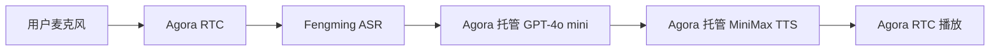

# Royal Arcana — AI 塔罗自我觉察

## 项目简介

这是一个结合塔罗抽牌、手势互动、AI 文字解读和 Agora 实时语音 Agent 的网页项目。

用户可以在一个优雅的舞会沙龙氛围中选择问题、洗牌抽牌、查看牌面解读，通过 AI 文字继续追问更深层的问题，也可以进入实时语音房与 AI 塔罗师进行多轮语音讨论。

## 主要功能

- **塔罗抽牌** — 单张牌或三张牌阵，扇形展开后点击或手势选择
- **手势洗牌与翻牌** — 基于 MediaPipe Hands 的摄像头手势交互
- **原始问题输入** — 抽牌前可写下想理解的问题
- **AI 深度追问** — 调用 DeepSeek API 生成个性化追问解读
- **多轮追问上下文** — 追问请求携带原始问题、牌面信息和追问历史
- **正位 / 逆位支持** — 每张牌随机分配方向（70% 正位 / 30% 逆位）
- **每日 AI 追问次数限制** — 前端 localStorage 限制每日 3 次 AI 追问
- **动态舞会视觉** — Ken Burns 动画背景、5 层运动系统、呼吸感氛围
- **实时语音房** — 进入语音房与 AI 塔罗师实时语音对话
- **中文语音识别** — Agora 托管 Fengming ASR，支持中文语音输入
- **AI 语音多轮讨论** — 支持多轮对话，可对当前抽牌结果深入讨论
- **Agent 上下文感知** — Agent 可读取用户原始问题、牌阵、牌名、正逆位和已有解读
- **语音控制** — 支持静音、结束会话和实时字幕
- **语音回答基于抽牌上下文** — 语音解读围绕当前抽到的牌和用户问题展开

## 技术架构

| 模块 | 厂商 / 技术 | 用途 |
|---|---|---|
| 前端 | Next.js + React + TypeScript | 页面与交互 |
| 静态部署 | GitHub Pages | 前端托管 |
| 手势识别 | MediaPipe Hands | 洗牌、选牌、翻牌 |
| Serverless 后端 | Vercel | Token、Agent 启动与停止 |
| 实时语音与 Agent | Agora Conversational AI Engine | 实时语音会话 |
| RTC / RTM | Agora | 音频传输与实时消息 |
| ASR | Agora 托管 Fengming | 中文语音识别 |
| LLM（语音 Agent） | Agora 托管 OpenAI GPT-4o mini preset | 多轮塔罗语音对话 |
| TTS | Agora 托管 MiniMax Speech 2.8 Turbo preset | 中文语音合成 |
| 音色 | Chinese (Mandarin)_Laid_BackGirl | 当前语音风格 |
| 文字追问 | DeepSeek API（通过后端代理） | 网页文字追问 |

> **注意：** 文字追问和语音 Agent 使用不同的 LLM：
> - **文字追问**（`/api/follow-up`）：由 `tarot-ai-backend` 后端调用 **DeepSeek API**，返回文字解读
> - **语音 Agent**：由 **Agora Conversational AI Engine** 托管，使用 **OpenAI GPT-4o mini** preset 进行多轮语音对话

项目不再使用 DeepSeek BYOK 或 MiniMax BYOK 方式接入 Agora 语音 Agent。

## 语音数据流

## 线上地址

https://wenjun-hello.github.io

## 后端接口

https://tarot-ai-backend.vercel.app/api/follow-up

## 注意事项

DeepSeek API Key 只保存在 Vercel 后端环境变量中，不会暴露在前端代码里。
